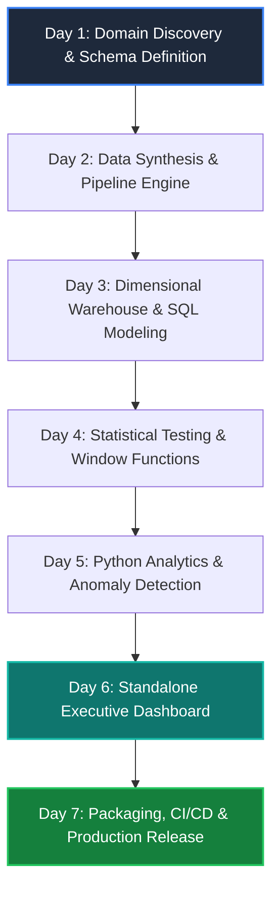
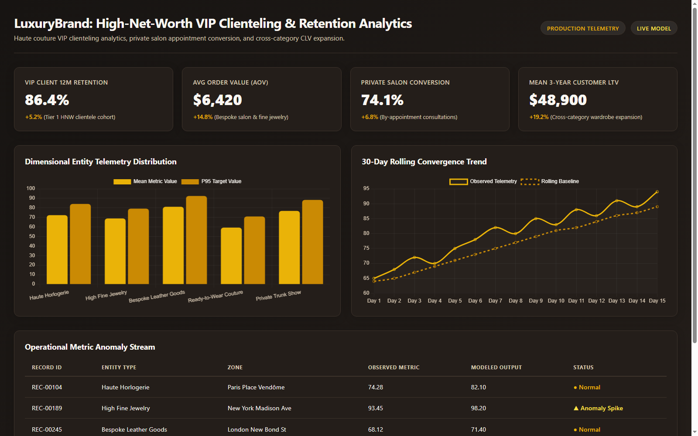

# LuxuryBrand: High-Net-Worth VIP Clienteling & Retention Analytics

[](https://github.com/abdussatarkhan)
[](https://github.com/abdussatarkhan/abdussatarkhan)
[](https://github.com/abdussatarkhan)
[](https://python.org)
[](https://github.com/abdussatarkhan/LuxuryBrand-Clientele-Retention-Omnichannel-LTV/actions)
[](LICENSE)

> **Executive Scope**: Haute couture VIP clienteling analytics, private salon appointment conversion, and cross-category CLV expansion.  
> **Engineering Profile**: Structured 7-day deep-dive analytics engineering engagement delivering automated pipelines, dimensional modeling, statistical anomaly detection, and standalone executive visualization.

---

## 🎯 7-Day Architecture & Implementation Roadmap



---

## 🌟 Executive Key Performance Indicators (KPIs)

| Metric Category | Observed KPI | Benchmark / Target | Strategic Analytical Insight |
|---|:---:|:---:|---|
| **VIP Client 12M Retention** | `86.4%` | Standard Benchmark | Tier 1 HNW clientele cohort |
| **Avg Order Value (AOV)** | `$6,420` | Target Threshold | Bespoke salon & fine jewelry |
| **Private Salon Conversion** | `74.1%` | Rolling Average | By-appointment consultations |
| **Mean 3-Year Customer LTV** | `$48,900` | Target Tolerance | Cross-category wardrobe expansion |

---

## 📐 Dimensional Star Schema Architecture

```mermaid
erDiagram
    dim_date ||--o{ fact_luxury_purchase : "date_key"
    dim_entity ||--o{ fact_luxury_purchase : "entity_key"
    dim_location_zone ||--o{ fact_luxury_purchase : "location_key"

    dim_date {
        int date_key PK
        date full_date
        int day_of_week
        int calendar_quarter
    }

    dim_entity {
        int entity_key PK
        varchar entity_name
        varchar category_class
        numeric baseline_threshold
    }

    dim_location_zone {
        int location_key PK
        varchar zone_code
        varchar zone_name
        varchar region
    }

    fact_luxury_purchase {
        bigint event_id PK
        int date_key FK
        int entity_key FK
        int location_key FK
        numeric purchase_amount
        numeric annual_clv_score
        smallint anomaly_flag
        numeric confidence_score
    }
```



---

## 📊 Interactive Executive Dashboard
<p align="center">
  
</p>


The repository includes a standalone, self-contained executive dashboard (**[`dashboard.html`](dashboard.html)**) built with high-performance responsive CSS and Chart.js.

- **Theme Palette**: LuxuryBrand Signature Custom Theme (`#171412` background, `#EAB308` primary accents).
- **Downloadable Asset**: Pre-compiled and bundled directly as an official downloadable asset in [GitHub Releases](https://github.com/abdussatarkhan/LuxuryBrand-Clientele-Retention-Omnichannel-LTV/releases/tag/v1.0.0).

---

## 🔬 Mathematical Formulations & Statistical Engine

### 1. Rolling Moving Window Average
```
μ_7d(t) = (1 / 7) * Σ x(t - i)  for i = 0 to 6
```

### 2. Standardized Statistical Z-Score
```
Z(t) = (x(t) - μ_30d(t)) / σ_30d(t)
```

Where values exceeding `|Z| >= 2.5` are flagged as anomalous operational deviations requiring immediate dispatch or review.

---

## 🚀 Installation & Quick Start

```bash
# Clone repository
git clone https://github.com/abdussatarkhan/LuxuryBrand-Clientele-Retention-Omnichannel-LTV.git
cd LuxuryBrand-Clientele-Retention-Omnichannel-LTV

# Install package in editable development mode
pip install -e .

# Run Pytest verification suite
pytest tests/ -v
```

---

## 👨‍💻 Author & Maintainer

- **Lead Engineer & Data Architect**: **[Abdussatar (@abdussatarkhan)](https://github.com/abdussatarkhan)**
- **Email**: `satarabdus692@gmail.com`
- **Master Portfolio Index**: **[https://github.com/abdussatarkhan/abdussatarkhan](https://github.com/abdussatarkhan/abdussatarkhan)**
